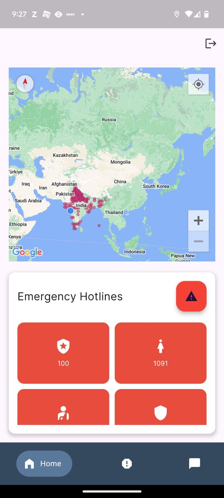
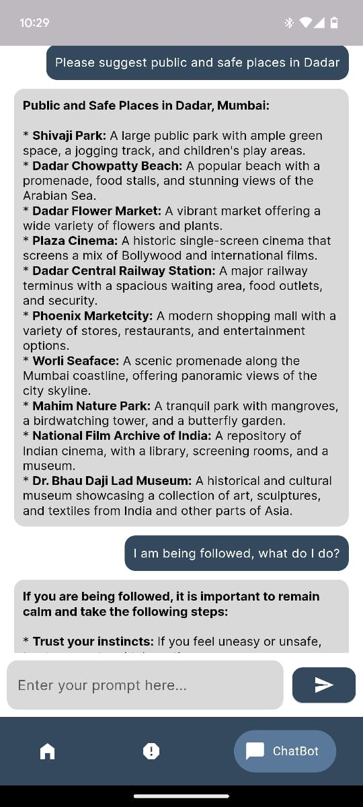
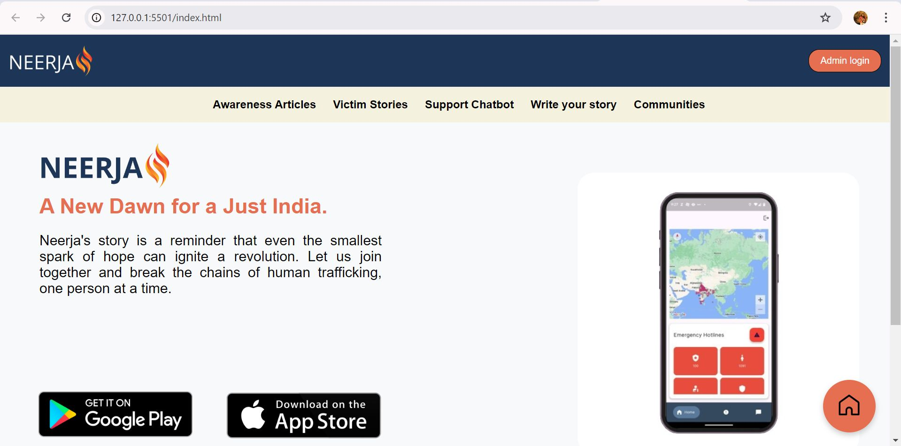

# 🚨 Women Safety Detection, Prevention & Support System 🚨

Welcome to the **Women Safety Detection, Prevention & Support System**! This project leverages AI/ML models, Django, and mobile technology to detect violent activities, provide alerts, and help individuals in distress. The system includes an admin dashboard for monitoring and a mobile app for safety and navigation.

---

## 🌟 Features

### 🔍 **AI/ML Detection**
- **Models Used**: MobileNet & Bi-directional LSTM  
- Trained on **1000 videos** of violent and non-violent activities.  
- Real-time analysis of **CCTV footage**.  
- Sends **alerts** to a centralized admin dashboard.  

### 🖥️ **Admin Website (Django)**
- Real-time dashboard for **violence detection alerts**.  
- Stories of trafficked individuals and their recovery journeys.  
- Comprehensive support resources and trafficking prevention information.  

### 📱 **Mobile App**
- **SOS Button**: Send distress signals with geolocation to the admin.  
- **Google Maps Integration**: Navigate to safety zones.  
- **Safety Features**: Contact sharing and location tracking.  

---
## 📸 Screenshots and Demo

- **Mobile App (Google Maps & SOS Button)**  
  

- **Chatbot**  
  

- **Website**  
  

- **Video Demo**  
  

## 🚀 Getting Started

Follow these steps to set up and run the project locally:

### 📦 Prerequisites

Ensure you have the following installed on your system:
- **Python 3.8+**  
- **Django 4.0+**  
- **TensorFlow/Keras for AI Model**  
- **Flutter** for the mobile app  
- **Google Maps API** for location services  
- **PostgreSQL** for the database  

### 🔧 Installation Steps

1. **Clone the repository**:
   ```bash
   git clone https://github.com/YourUsername/human-trafficking-detection.git
   cd human-trafficking-detection
   ```

2. **Install dependencies**:
   ```bash
   pip install -r requirements.txt
   ```

3. **Set up db**:
   ```bash
   python manage.py migrate
   ```

4. **Run the Django development server**:
   ```bash
   python manage.py runserver
   ```

5. **Expose the backend using ngrok**:
   ```bash
   ngrok http 8000
   ```

6. **Configure the mobile app**:
   - Replace the API endpoint in the Flutter project with your ngrok URL.
   - Add your Google Maps API key.

7. **Run the mobile app**:
   ```bash
   flutter pub get
   flutter run
   ```

---

## 🙌 Contributions

Contributions are welcome! Please create a pull request or submit an issue to propose changes or report bugs.

---

## 🛠️ License

This project is licensed under the MIT License. See the `LICENSE` file for details.

---

## 🔖 Tags

- `#HumanTrafficking`
- `#AIForGood`
- `#MachineLearning`
- `#MobileNet`
- `#Django`
- `#Flutter`
- `#SOSApp`
- `#CCTVViolenceDetection`
- `#GoogleMapsAPI`
- `#SafetyTech`
- `#SocialImpact`
- `#AIProjects`
- `#HumanRights`

---

